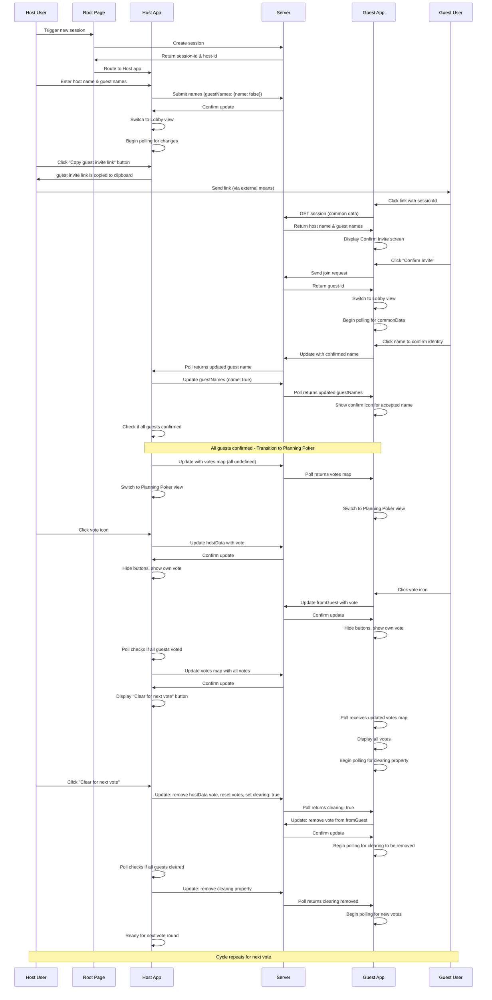

# Planning Poker Sequence Diagram

## Overview
This diagram shows the interaction flow for the Planning Poker application using the Facetious Nocturn session system.

## Legend

| Actor | Role |
|-------|------|
| Host User | Initiates session and manages voting rounds |
| Root Page | Entry point that routes to Host app |
| Host App | Manages session, coordinates guest confirmations, and aggregates votes |
| Server | Persists session state and serves as communication hub |
| Guest App | Displays voting interface for guest users |
| Guest User | Accepts invitation and submits votes |

## Key Data Structures

### Common Data (shared between Host and Guests)
- `hostName`: Name of the host
- `guestNames`: Map of guest names with boolean status (false = not confirmed, true = confirmed)
- `votes`: Map of votes from all participants (initially undefined values)
- `clearing`: Boolean flag to signal vote clearing (removed once complete)

### From Guest Data
- `name`: Name chosen during lobby confirmation
- `vote`: Vote submitted during Planning Poker phase

### Host Data
- `vote`: Vote submitted by the host during Planning Poker phase
